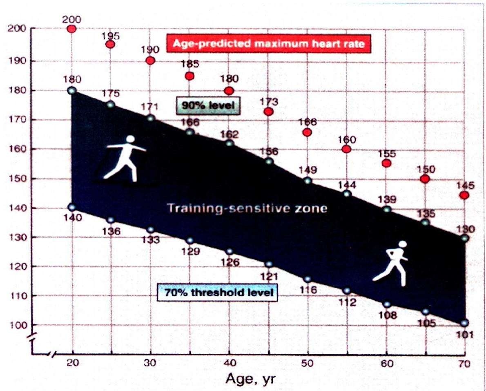

# Corso Istruttore
## Corpo umano

- cellula
  - unità base vita
  - strutture comuni e caratteristiche
    - sia in unicellulari che pluricellulari
  - in pluricellulari
    - cellule si specializzano in base ai compiti
      - es cellula muscolare: miofibrille...
  - struttura cellulare
    - nucleo
      - dna
    - citoplasma
      - vari organuli
        - produrre materiale/energia/difesa
- organi del movimento
  - SNC e SNP
  - respiratorio
  - cardiocircolatorio
  - osteoarticolare
  - muscolare
- metabolismi
  - aerobico
  - anaerobico
    - analattacido
    - lattacido
- per far funzionare il metabolismo
  - sia carburante
    - cibo risorse
  - sia corburente
    - ossigeno
      - non stoccato --> continuamente rifornito
      - si va a prendere verso l'esterno
        - aria composta al 20%
- circolazione ossigeno
  - preso dai polmoni agli alveoli
  - capillari assorbono ossigeno
  - vena ossigenata mandata al cuore
  - cuore spedisce l'ossigeno, attraverso l'aorta, in tutto il corpo
- tutto controllato dal SNC e SNP
  - SNC nella scatola cranica
    - cervello/midollo/nervi cranici
  - SNP attraverso colonna vertebrale
    - nervi spinali/SNA/S-simpatico/S-parasimpatico
  - stimoli arrivano e reagisce in modo volontario o involontario (senza corteccia cerebrale)
    - o anche senza stimoli
  - SNA invece
    - periferico ma si auto regola
      - non arriva al SNC
    - bilanciato tra S-simpatico e S-parasimpatico
    - controlla organi interni
      - soprattutto apparato digestivo
- S-simpatico e S-parasimpatico agiscono anche sul cuore
  - innervazione complessa
    - anche innervazione sua e afferenze del S-simpatico e S-parasimpatico
      - per il controllo del battito
        - S-simpatico --> aumenta battito
        - S-parasimpatico --> diminuisce battito
  - alimenti/farmaci/ormoni possono influire sui due sistemi --> quindi anche sul battito
- agiscono anche sui bronchi/bronchioli
  - hanno una tunica muscolare liscia
    - restringimento/allargamento
      - es asmatici: stimolo eccessivo recettori restringimento
        - --> farmaci bronco dilatatori allargando i bronchi (direttamente o indirettamente)
- per imparare un movimento --> bisogna imparare a farla (attraverso la coscienza)
- una volta memorizzato --> svolta in modalità semi-automatica
  - interverrà solo quando dovrà decidere di cambiare movimenti
- apparato respiratorio
  - stessa via per andata e ritorno
  - aria entra in due possibili vie
    - nasali
      - strada più lunga
      - quantità di aria più bassa
      - ma si scalda ed umidifica
    - orali
      - il contrario
  - si uniscono al livello della faringe
  - entra nella trachea
    - sostenuta da anelli di cartilagine != esofago
      - sempre aperta
  - entra nella cassa toracica
    - passa per la laringe
      - dove alloggiano le corde vocali
  - si biforca nei due bronchi principali: polmone sinistro e destro
  - bronchi --> bronchioli --> alveoli
    - sacchetti che si riempioni di aria
    - consentono scambi con il sangue
  - si ritorna su per le stesse vie
  - come avviene uscita ed entrata aria?
    - differenza pressione negativa/positiva
      - negativa: entra
      - positiva: esce
  - grazie a muscolatura
    - diaframma 
      - diametro longitudinale
      - muscolo piatto ma ampio
      - contrarsi: si abbassa
      - rilassa: si alza
    - muscoli intercostali
      - diametro trasversale
    - quando respirazione molto affannosa
      - muscoli accessori intervengono che vanno a contrarsi per aprire di più il torace
        - es collo e tronco superiore
  - cambia cicli di respirazione
    - riposo
      - 12
      - 0,5 l
      - 6 l/min
    - affannosa
      - 40/50
      - 3 l
      - 150 l/min
      - 20/30 volte in più
      - --> maggiore apporto di ossigeno
    - facile da contare (anche a distanza)
  - in modalità completamente aerobiche
    - quando si finisce --> respiro torna subito normale
  - in modalità anaerobiche
    - contrae un debito di ossigeno
    - anaerobico deve essere riciclato in aerobico
    - quando finisce --> bisogna aspettare quanto necessario al recupero
      - indice di affaticamento di sforzo
- apparato circolatorio
  - aria arriva ai capillari
  - schema circolatorio
    - piccolo circolo (polmonare)
      - dal cuore
      - arterie senza ossigeno
      - passa per i polmoni
      - vene con ossigeno
      - al cuore
    - grande circolo (sistemico)
      - dal cuore
      - arterie con ossigeno (a partire da aorta)
      - passa per il corpo
      - vene senza ossigeno
      - al cuore
  - circolo non solo ossigeno ma anche sostanze di scarto
  - atri e ventricoli
    - parte destra: corpo --> polmoni
    - parte sinistra: polmoni --> corpo
  - tutto gestito da valvole (sono 4)
    - tra atri e ventricoli
      - valvola tricuspide (destro)
      - valvola bicuspide o mitrale
    - tra ventricoli e arterie (danno il battito)
      - valvole semilunari
  - capacità
    - a riposo
      - 60 battiti/min
      - 60 cc (0,060 l) per un battito
      - 3,6 l/min
    - sotto sforzo
      - 150/200 battiti/min
        - in base all'età
          - pareti diventano meno elastiche --> minori battiti
          - 220 battiti - età
      - 100 cc per un battiti
      - 15/20 l/min
      - 4/5 volte in più
      - --> meno possibilità di incremento di apporto di ossigeno
    - per contare pulsazioni:
      - sulle arterie che scorrono più superficialmente
        - polso
        - collo
    - emodinamica
      - riposo
        - pressione arteriosa: 120/70 mm/hg
          - sistolica e diastolica (massimo e minimo)
        - pressione capillari: 10-30 mm/hg
          - nelle vene diventa ancora più bassa
      - sotto sforzo
        - aumentano
          - gittata sistolica
          - frequenza cardiaca (220-età)
          - pressione arteriosa (più negli sport di potenza che in quelli di resistenza)
        - pressione arteriosa: 220-230 sistolica
          - pericolosi anche per un cardiopatico
    - più alta la frequenza --> + regime anaerobico
- apparato locomotore
  - 3 tessuti principali
    - le ossa
      - funzione sostegno
      - muovendosi permettono movimento
      - (vedere libro)
    - articolazioni
      - connettono ossa
      - consentono o limitano movimento
      - tanti diversi tipi
        - complesse (diartrosi)
          - capsula articolare
          - membrana sinoviale
          - liquido sinoviale
          - punto di contatto tra ossa: cartilagine
            - per facilitare movimento
        - fisse
          - nel cranio
          - con l'invecchiamento si fondono
        - alcuni movimenti limitati
          - tra le vertebre
        - consentono movimento su un piano spaziale
          - articolazioni ginocchia
            - solo flessione estensione
              - ma in persone con particolare flessibilità anche in lateralizzazione
        - consentono più movimento
          - la spalla
            - molto complessa e delicata
              - principale problema dei nuotatori
    - muscoli
      - vero motore
      - possibilità di allungarsi e retrarsi --> originano movimento
      - insieme di cellule molto specializzate
        - muscolo scheletrico striato
          - fascio di fibre muscolari --> cellula (fibra muscolare) --> miofibrille
            - matriosca
              - separate tra tessuto connettivo e collagene
            - modalità contrazione da due filamenti
              - actina
              - miosina
                - pretuberanze
                  - nel momento della contrazione: si aggangiano alla actina e la muovono (come dei remi)
              - a riposo
                - allungate una sull'altra
              - in contrazione
                - si avvicinano
      - si aggancia a due osse diverse (domanda esame)
        - ossa collegate tramite articolazioni
          - muscoli determinano il movimento
    - chimica nella contrazione
      - **stimolo** da SNC
        - **elettrico**
          - depolarizzazione/ripolarizzazione di sodio e potassio
      - tramite motoneurone nelle vicinanze della cellula muscolare
      - --> sinapsi
        - terminazione motoneurone
        - **ultimo passo diventa chimico**
          - molecola che passa dal motoneurone alla cellula muscolare
      - stimolo biochimico --> **libera gli ioni calcio**
        - sviluppa uno stimolo che porta alla reazione di **ATP in ADP**
      - --> **liberazione energia**
        - actina si avvicina alla miosina
      - --> **contrazione muscolo**
  - sistema di leve
    - 3 tipi
      - 1 specie: forza motrice - fulcro - resistenza
      - 2 specie: fulcro - resistenza - forza motrice
        - sempre vantaggiosa
        - es: leva sulle punte dei piedi
        - sforzo minimo, ma escursione minima
      - 3 specie: fulcro - forza motrice - resistenza
        - sempre svantaggiosa
        - es: spalla
        - tanta forza da applicare, ma escursione elevata
  - tipo di contrazione
    - actina scivola sempre nella miosina
    - ma nel complesso non è detto che si accorci
      - contrazione **concentrica**
        - si accorcia e genera avvicinamento delle ossa
      - contrazione **eccentrica**
        - si allunga e genera allontamento delle ossa
        - molto più stressante per il muscolo
          - carichi molto superiori al limite che può esercitare
          - ammortizzare peso corpo dopo un balzo
      - contrazione **isometrica**
        - né si allunga, né si accorcia e non genera movimento
        - contro struttura inamovibile
  - tipo di movimento
    - può essere misto o selettivo
    - **isotonico**
      - carico rimane uguale
      - forza resistente da vincere uguale per tutto il movimento
      - in natura difficile da verificarsi
        - a diverse angolature di movimento, può variare forza resistente in funzione della leva
        - alcuni macchinari in palestra riescono a mantenere il movimento sempre isotonico
    - **isometrico**
      - contro resistenza che non si muove --> non c'è movimento
    - **isocinetico**
      - costante la velocità del movimento
        - no accelerazioni o decelerazioni
    - in realtà maggior parte di tipo di misto
      - anche se su terra più cambi di velocità
      - nel nuoto: aumentanto resistenze --> meno accelerazioni
        - ma senza mai arrivare all'isocinetico
        - una volta preparazione a secco con panca biocinetica
          - limitazioni accelerazioni come in acqua

